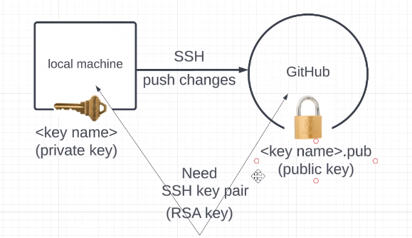
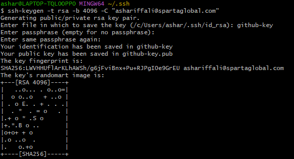
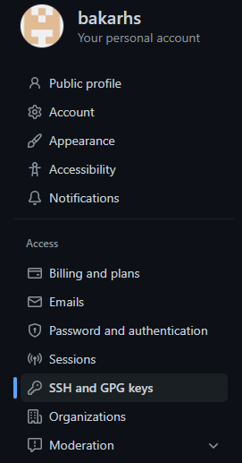

# SSH-keys
SSH-keys



## Step 1: Create rsa key 

- Start by opening up a GitBash terminal (as administrator)
- generate key command : 
```
ssh-keygen -t rsa -b -C <emailaddress>
```



## Step 2: add our key to GitHub

- In your GitHub move ever to setting s and to SSH keys:



- Add a new SSH key - name it appropriate and enter your `.pub` version of the key. DO NOT USE THE PRIVATE VERSION OF THE KEY (should begin with `ssh-rsa`)

## Step 3: Add our private key to our ssh list of keys
- In your GitBash terminal:
```
eval `ssh-agent -s` # starting the ssh agent
ssh-add <key name> 
```
- To test if this is successful (you may need to type in `yes` after doing this: 
```
ssh -T git@github.com
```

Returns:
```
Hi bakarhs! You've successfully authenticated, but GitHub does not provide shell access.
```

## Step 4: Create a tes repo
- Create a test repo - dont add a `README.md so we caan show how we go this in GitBash`
- Through GitBash create a local repo with the same name as the test repo you made on GitHub (make sure to cd into the right directory for this as it is unique to where you save your local repo)
- Create a README.md file within the new local repo and add some content to the README:
```
touch README.md
nano README.md
# From here you will be inside you reade me and write some content
```
- Run a `cat README.md` to ensure the content is inside the file
## Step 5: successfully pushed changes using ssh
```
git init
# Creates the hidden folder `.git` and certain files that store the changes, commits, and changes in the staged area

git add .
# adds all the changes made to the staging area

git status
# checking the status of all the changes made so far in the repo and making sure they are tracked by github

git commit -m "<notes on changes>"
# commits the changes made to the repo

git branch -M main
# switches the branch used to push the changes

git remote add origin <the SSH path from your repo on github.com> # specifies the SSH version of the remote repo we want to use

git push -u origin main
# pushes the changes to the repo you picked and the branch through which you specify it
```


# NOTE

- Make sure to push from the same terminal you used eval `ssh-agent -s`


